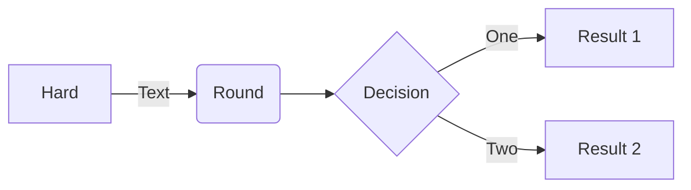

# Introduction

## Mermaid


## PlantUML
```plantuml
Bob -> Alice : hello
```

## Include Code
### Include the Program.cs file
[!code-csharp[](Program.cs)]
### Include the Program.cs file with a specific range
[!code-csharp[Main](Program.cs#L1-L10)]
### Highlight specific lines in the Program.cs file
[!code-csharp[](Program.cs?highlight=2,5-7,9-10)]

## Tabs
# [Linux](#tab/linux)

Content for Linux...

# [Windows](#tab/windows)

Content for Windows...

### Tabs dependent on the above windows and linux tabs
# [.NET](#tab/dotnet/linux)

.NET content for Linux...

# [.NET](#tab/dotnet/windows)

.NET content for Windows...

# [TypeScript](#tab/typescript/linux)

TypeScript content for Linux...

# [TypeScript](#tab/typescript/windows)

TypeScript content for Windows...

# [REST API](#tab/rest)

REST API content, independent of platform...

---
